# [📈 Live Status](https://uptime.pearanalytics.com): <!--live status--> **🟩 All systems operational**

This repository contains the open-source uptime monitor and status page for [pearanalytics](https://uptime.pearanalytics.com), powered by [Upptime](https://github.com/upptime/upptime).

With [Upptime](https://upptime.js.org), you can get your own unlimited and free uptime monitor and status page, powered entirely by a GitHub repository. We use [Issues](https://github.com/pearanalytics/uptime/issues) as incident reports, [Actions](https://github.com/pearanalytics/uptime/actions) as uptime monitors, and [Pages](https://uptime.pearanalytics.com) for the status page.

<!--start: status pages-->
<!-- This summary is generated by Upptime (https://github.com/upptime/upptime) -->
<!-- Do not edit this manually, your changes will be overwritten -->
<!-- prettier-ignore -->
| URL | Status | History | Response Time | Uptime |
| --- | ------ | ------- | ------------- | ------ |
|  [Pear Analytics](https://pearanalytics.com) | 🟩 Up | [pear-analytics.yml](https://github.com/pearanalytics/uptime/commits/HEAD/history/pear-analytics.yml) | 

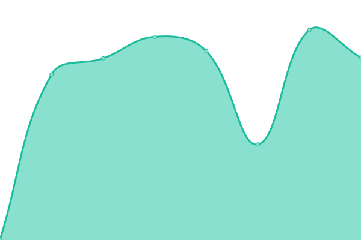 413ms
     
 | 

<a href="https://uptime.pearanalytics.com/history/pear-analytics">99.36%</a>
    

|  [Pear Dev Site](https://dev.pearanalytics.com) | 🟩 Up | [pear-dev-site.yml](https://github.com/pearanalytics/uptime/commits/HEAD/history/pear-dev-site.yml) | 

 431ms
     
 | 

<a href="https://uptime.pearanalytics.com/history/pear-dev-site">100.00%</a>
    

|  [fladvisors](https://fladvisors.com) | 🟩 Up | [fladvisors.yml](https://github.com/pearanalytics/uptime/commits/HEAD/history/fladvisors.yml) | 

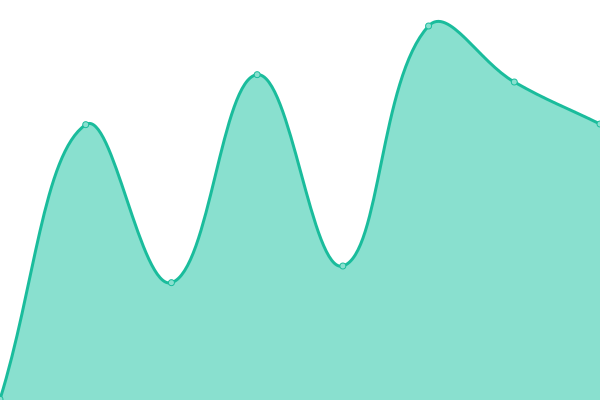 413ms
     
 | 

<a href="https://uptime.pearanalytics.com/history/fladvisors">100.00%</a>
    

|  [copc](https://copc.com) | 🟩 Up | [copc.yml](https://github.com/pearanalytics/uptime/commits/HEAD/history/copc.yml) | 

 732ms
     
 | 

<a href="https://uptime.pearanalytics.com/history/copc">100.00%</a>
    

|  [universalbb](https://universalbookbindery.com) | 🟩 Up | [universalbb.yml](https://github.com/pearanalytics/uptime/commits/HEAD/history/universalbb.yml) | 

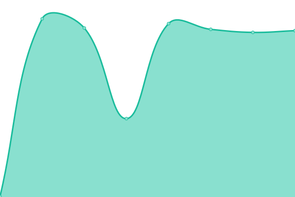 354ms
     
 | 

<a href="https://uptime.pearanalytics.com/history/universalbb">100.00%</a>
    

|  [concussionguy](https://concussionguy.com) | 🟩 Up | [concussionguy.yml](https://github.com/pearanalytics/uptime/commits/HEAD/history/concussionguy.yml) | 

 363ms
     
 | 

<a href="https://uptime.pearanalytics.com/history/concussionguy">100.00%</a>
    

|  [alamonote](https://alamonote.wpengine.com) | 🟩 Up | [alamonote.yml](https://github.com/pearanalytics/uptime/commits/HEAD/history/alamonote.yml) | 

 718ms
     
 | 

<a href="https://uptime.pearanalytics.com/history/alamonote">100.00%</a>
    

|  [shirane](https://shiranefoundation.org) | 🟩 Up | [shirane.yml](https://github.com/pearanalytics/uptime/commits/HEAD/history/shirane.yml) | 

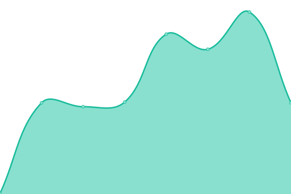 473ms
     
 | 

<a href="https://uptime.pearanalytics.com/history/shirane">100.00%</a>
    

|  [eharris](https://eharrismd.com) | 🟩 Up | [eharris.yml](https://github.com/pearanalytics/uptime/commits/HEAD/history/eharris.yml) | 

 811ms
     
 | 

<a href="https://uptime.pearanalytics.com/history/eharris">100.00%</a>
    

|  [bhrnew](https://berkshirehairremoval.com) | 🟩 Up | [bhrnew.yml](https://github.com/pearanalytics/uptime/commits/HEAD/history/bhrnew.yml) | 

 368ms
     
 | 

<a href="https://uptime.pearanalytics.com/history/bhrnew">100.00%</a>
    

|  [acadian](https://acadianlogistics.com) | 🟩 Up | [acadian.yml](https://github.com/pearanalytics/uptime/commits/HEAD/history/acadian.yml) | 

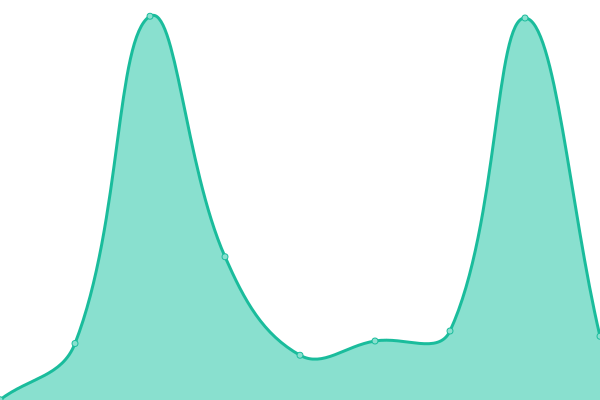 883ms
     
 | 

<a href="https://uptime.pearanalytics.com/history/acadian">100.00%</a>
    

|  [beaconunited2](http://beacon-united.com) | 🟩 Up | [beaconunited2.yml](https://github.com/pearanalytics/uptime/commits/HEAD/history/beaconunited2.yml) | 

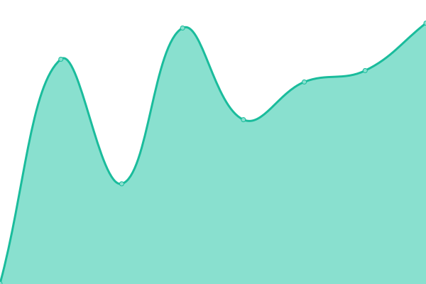 500ms
     
 | 

<a href="https://uptime.pearanalytics.com/history/beaconunited2">100.00%</a>
    

|  [strauch](https://www.strauchlaw.com) | 🟩 Up | [strauch.yml](https://github.com/pearanalytics/uptime/commits/HEAD/history/strauch.yml) | 

 491ms
     
 | 

<a href="https://uptime.pearanalytics.com/history/strauch">100.00%</a>
    

|  [amazingair](https://amazingairsolutions.co) | 🟩 Up | [amazingair.yml](https://github.com/pearanalytics/uptime/commits/HEAD/history/amazingair.yml) | 

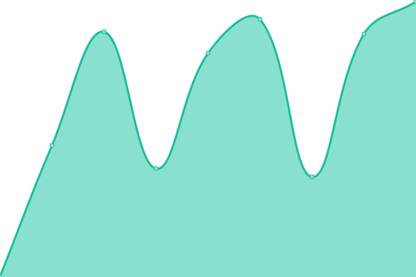 749ms
     
 | 

<a href="https://uptime.pearanalytics.com/history/amazingair">99.66%</a>
    

|  [firsttexan](https://firsttexanrealty.com) | 🟩 Up | [firsttexan.yml](https://github.com/pearanalytics/uptime/commits/HEAD/history/firsttexan.yml) | 

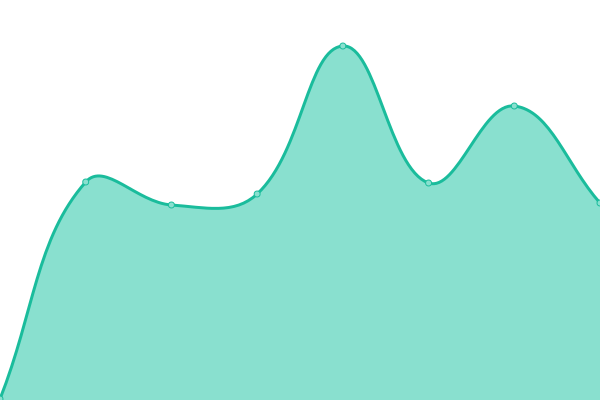 343ms
     
 | 

<a href="https://uptime.pearanalytics.com/history/firsttexan">100.00%</a>
    

|  [najim](https://najimfoundation.org) | 🟩 Up | [najim.yml](https://github.com/pearanalytics/uptime/commits/HEAD/history/najim.yml) | 

 5217ms
     
 | 

<a href="https://uptime.pearanalytics.com/history/najim">100.00%</a>
    

|  [contegoim](https://contegoim.com) | 🟩 Up | [contegoim.yml](https://github.com/pearanalytics/uptime/commits/HEAD/history/contegoim.yml) | 

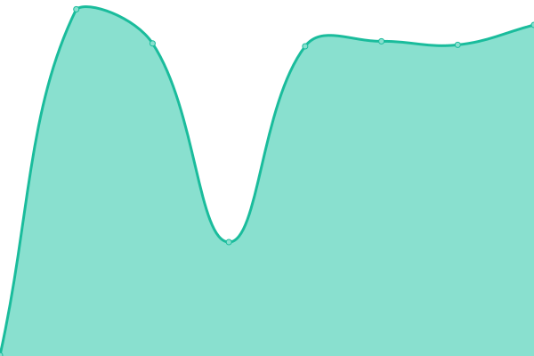 346ms
     
 | 

<a href="https://uptime.pearanalytics.com/history/contegoim">100.00%</a>
    

|  [alamomineral](https://alamomineralbuyers.com) | 🟩 Up | [alamomineral.yml](https://github.com/pearanalytics/uptime/commits/HEAD/history/alamomineral.yml) | 

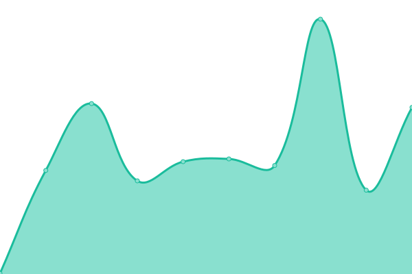 313ms
     
 | 

<a href="https://uptime.pearanalytics.com/history/alamomineral">100.00%</a>
    

|  [alamohomebuyer](https://alamohomebuyers.com) | 🟩 Up | [alamohomebuyer.yml](https://github.com/pearanalytics/uptime/commits/HEAD/history/alamohomebuyer.yml) | 

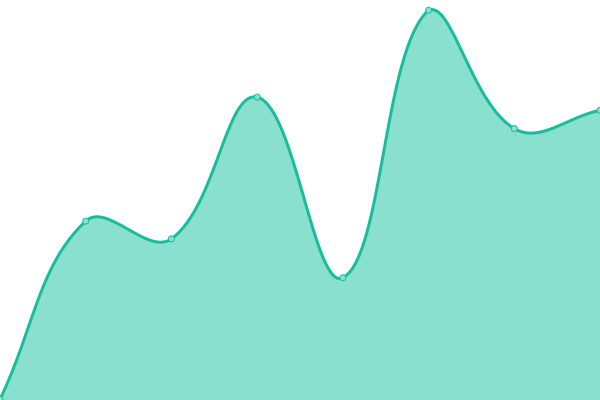 355ms
     
 | 

<a href="https://uptime.pearanalytics.com/history/alamohomebuyer">85.95%</a>
    

|  [fascinationsp](https://fascinationstreetpod.com) | 🟩 Up | [fascinationsp.yml](https://github.com/pearanalytics/uptime/commits/HEAD/history/fascinationsp.yml) | 

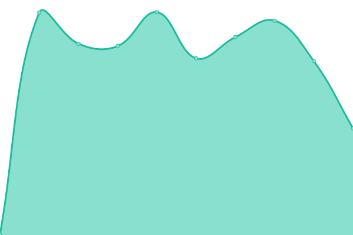 389ms
     
 | 

<a href="https://uptime.pearanalytics.com/history/fascinationsp">100.00%</a>
    

|  [alamobuyers](https://alamobuyers.com) | 🟩 Up | [alamobuyers.yml](https://github.com/pearanalytics/uptime/commits/HEAD/history/alamobuyers.yml) | 

 406ms
     
 | 

<a href="https://uptime.pearanalytics.com/history/alamobuyers">100.00%</a>
    

|  [saparksfound](https://saparksfoundation.org) | 🟩 Up | [saparksfound.yml](https://github.com/pearanalytics/uptime/commits/HEAD/history/saparksfound.yml) | 

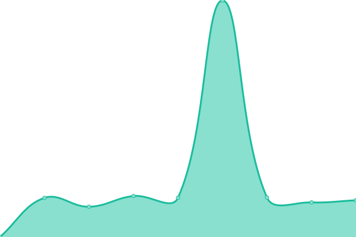 459ms
     
 | 

<a href="https://uptime.pearanalytics.com/history/saparksfound">100.00%</a>
    

|  [riachueloranch](https://riachueloranch.com) | 🟩 Up | [riachueloranch.yml](https://github.com/pearanalytics/uptime/commits/HEAD/history/riachueloranch.yml) | 

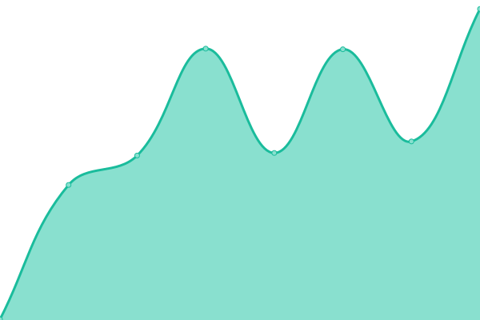 436ms
     
 | 

<a href="https://uptime.pearanalytics.com/history/riachueloranch">100.00%</a>
    

|  [ignitecc](https://ignitecommunity.church) | 🟩 Up | [ignitecc.yml](https://github.com/pearanalytics/uptime/commits/HEAD/history/ignitecc.yml) | 

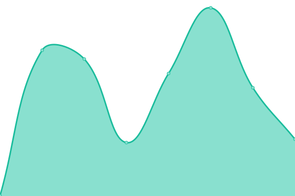 495ms
     
 | 

<a href="https://uptime.pearanalytics.com/history/ignitecc">100.00%</a>
    

|  [idpsalientup](https://indirectpro.com) | 🟩 Up | [idpsalientup.yml](https://github.com/pearanalytics/uptime/commits/HEAD/history/idpsalientup.yml) | 

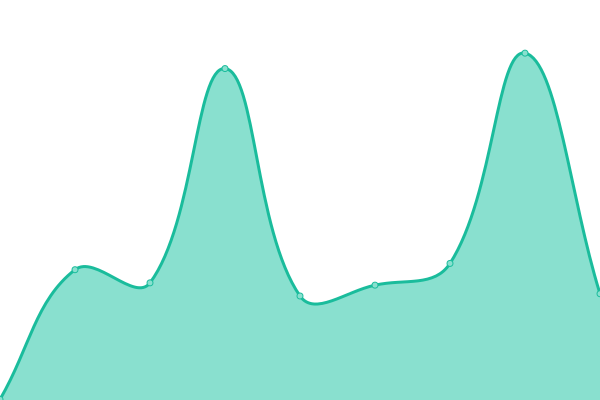 840ms
     
 | 

<a href="https://uptime.pearanalytics.com/history/idpsalientup">99.69%</a>
    

|  [hartmanfound](https://gordonhartman.com) | 🟩 Up | [hartmanfound.yml](https://github.com/pearanalytics/uptime/commits/HEAD/history/hartmanfound.yml) | 

 1169ms
     
 | 

<a href="https://uptime.pearanalytics.com/history/hartmanfound">100.00%</a>
    

|  [hotshotfinal](https://hotshotfinalmile.com) | 🟩 Up | [hotshotfinal.yml](https://github.com/pearanalytics/uptime/commits/HEAD/history/hotshotfinal.yml) | 

 423ms
     
 | 

<a href="https://uptime.pearanalytics.com/history/hotshotfinal">100.00%</a>
    

|  [workatmercho](https://workatmerchco.com) | 🟩 Up | [workatmercho.yml](https://github.com/pearanalytics/uptime/commits/HEAD/history/workatmercho.yml) | 

 452ms
     
 | 

<a href="https://uptime.pearanalytics.com/history/workatmercho">100.00%</a>
    

|  [merchcomain](https://merchcoservices.com) | 🟩 Up | [merchcomain.yml](https://github.com/pearanalytics/uptime/commits/HEAD/history/merchcomain.yml) | 

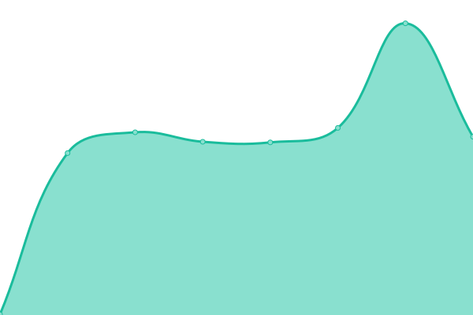 466ms
     
 | 

<a href="https://uptime.pearanalytics.com/history/merchcomain">100.00%</a>
    

|  [hdnew](https://www.thetriallawyers.com) | 🟩 Up | [hdnew.yml](https://github.com/pearanalytics/uptime/commits/HEAD/history/hdnew.yml) | 

 480ms
     
 | 

<a href="https://uptime.pearanalytics.com/history/hdnew">100.00%</a>
    

|  [tuyatech](https://tuyatech.com) | 🟩 Up | [tuyatech.yml](https://github.com/pearanalytics/uptime/commits/HEAD/history/tuyatech.yml) | 

 406ms
     
 | 

<a href="https://uptime.pearanalytics.com/history/tuyatech">100.00%</a>
    

|  [robinsonvm](https://www.robinsonvalue.com) | 🟩 Up | [robinsonvm.yml](https://github.com/pearanalytics/uptime/commits/HEAD/history/robinsonvm.yml) | 

 428ms
     
 | 

<a href="https://uptime.pearanalytics.com/history/robinsonvm">100.00%</a>
    

|  [edgecombe](https://edgecombe.com) | 🟩 Up | [edgecombe.yml](https://github.com/pearanalytics/uptime/commits/HEAD/history/edgecombe.yml) | 

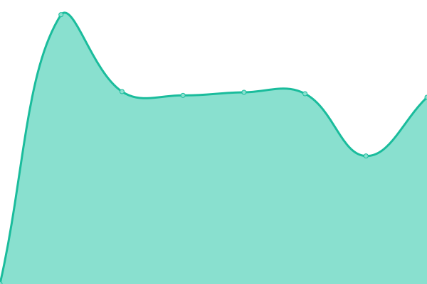 1121ms
     
 | 

<a href="https://uptime.pearanalytics.com/history/edgecombe">100.00%</a>
    

|  [lesauce](https://lesaucecompany.com) | 🟩 Up | [lesauce.yml](https://github.com/pearanalytics/uptime/commits/HEAD/history/lesauce.yml) | 

 451ms
     
 | 

<a href="https://uptime.pearanalytics.com/history/lesauce">100.00%</a>
    

|  [sacounselors](https://sacounselors.wpengine.com) | 🟩 Up | [sacounselors.yml](https://github.com/pearanalytics/uptime/commits/HEAD/history/sacounselors.yml) | 

 1397ms
     
 | 

<a href="https://uptime.pearanalytics.com/history/sacounselors">100.00%</a>
    

|  [officefurnliq](https://www.officefurnituresa.com) | 🟩 Up | [officefurnliq.yml](https://github.com/pearanalytics/uptime/commits/HEAD/history/officefurnliq.yml) | 

 702ms
     
 | 

<a href="https://uptime.pearanalytics.com/history/officefurnliq">100.00%</a>
    

|  [espronceda](https://alamodivorcelawyer.com) | 🟩 Up | [espronceda.yml](https://github.com/pearanalytics/uptime/commits/HEAD/history/espronceda.yml) | 

 425ms
     
 | 

<a href="https://uptime.pearanalytics.com/history/espronceda">100.00%</a>
    

|  [Pear Tools](https://tools.pearanalytics.com) | 🟩 Up | [pear-tools.yml](https://github.com/pearanalytics/uptime/commits/HEAD/history/pear-tools.yml) | 

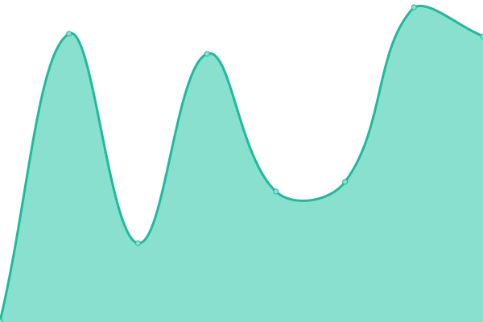 227ms
     
 | 

<a href="https://uptime.pearanalytics.com/history/pear-tools">100.00%</a>
    

|  [Texas WFC](https://texaswfc.com) | 🟩 Up | [texas-wfc.yml](https://github.com/pearanalytics/uptime/commits/HEAD/history/texas-wfc.yml) | 

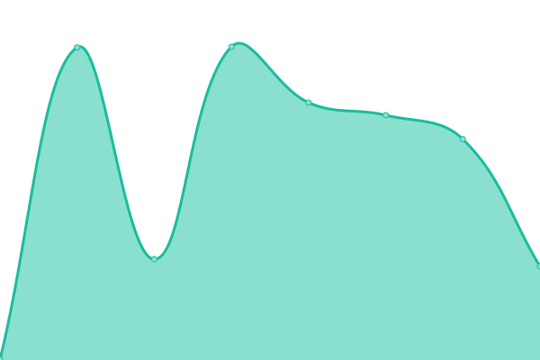 332ms
     
 | 

<a href="https://uptime.pearanalytics.com/history/texas-wfc">100.00%</a>
    

|  [Xenex](https://xenex.com) | 🟩 Up | [xenex.yml](https://github.com/pearanalytics/uptime/commits/HEAD/history/xenex.yml) | 

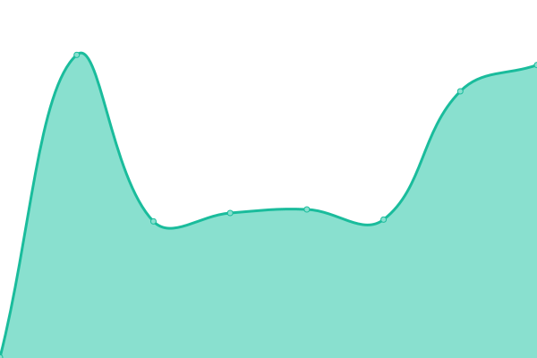 429ms
     
 | 

<a href="https://uptime.pearanalytics.com/history/xenex">100.00%</a>
    

|  [Lumber Hardware](https://lumberhardware.com) | 🟩 Up | [lumber-hardware.yml](https://github.com/pearanalytics/uptime/commits/HEAD/history/lumber-hardware.yml) | 

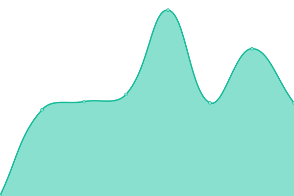 492ms
     
 | 

<a href="https://uptime.pearanalytics.com/history/lumber-hardware">100.00%</a>
    

|  [Haven for Hope](https://www.havenforhope.org) | 🟩 Up | [haven-for-hope.yml](https://github.com/pearanalytics/uptime/commits/HEAD/history/haven-for-hope.yml) | 

 392ms
     
 | 

<a href="https://uptime.pearanalytics.com/history/haven-for-hope">100.00%</a>
    

|  [Paramour Bar](https://paramourbar.com) | 🟩 Up | [paramour-bar.yml](https://github.com/pearanalytics/uptime/commits/HEAD/history/paramour-bar.yml) | 

 383ms
     
 | 

<a href="https://uptime.pearanalytics.com/history/paramour-bar">100.00%</a>
    

<!--end: status pages-->

[**Visit our status website →**](https://uptime.pearanalytics.com)

## 📄 License

- Powered by: [Upptime](https://github.com/upptime/upptime)
- Code: [MIT](./LICENSE) © [pearanalytics](https://uptime.pearanalytics.com)
- Data in the `./history` directory: [Open Database License](https://opendatacommons.org/licenses/odbl/1-0/)
