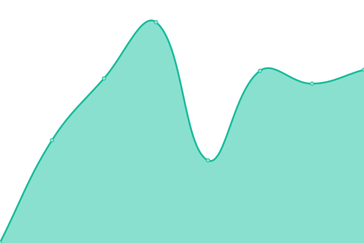
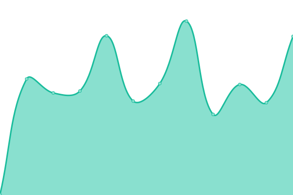
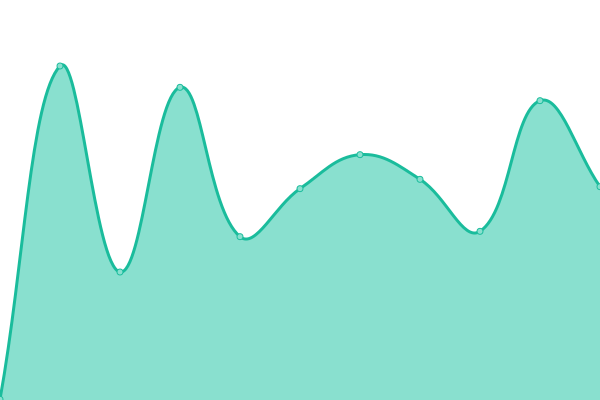
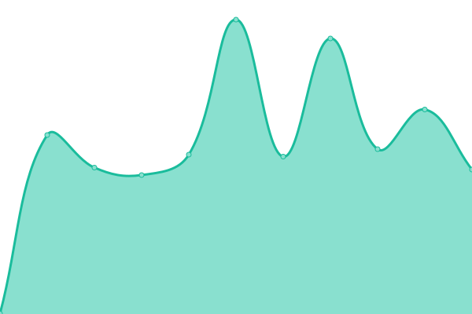
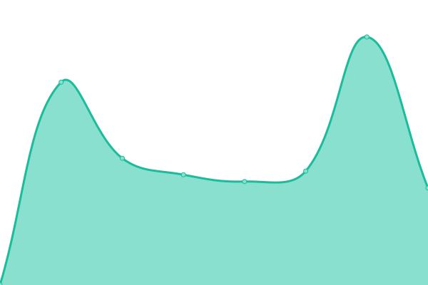
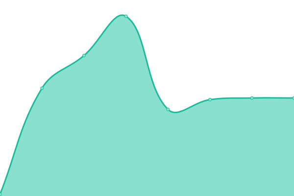
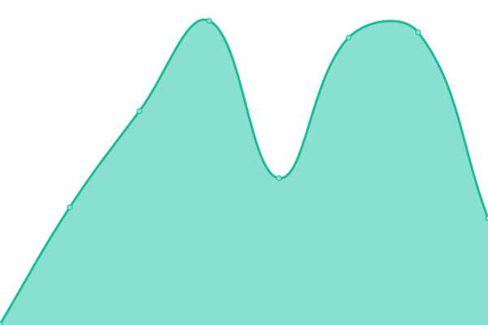
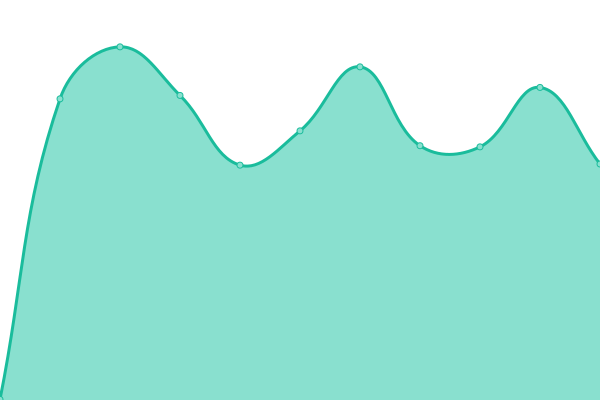
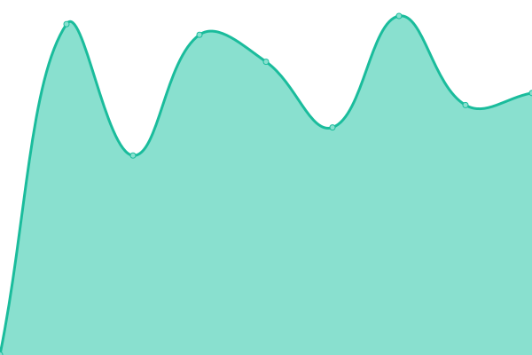

# [📈 Live Status](https://uptime.pearanalytics.com): <!--live status--> **🟧 Partial outage**

This repository contains the open-source uptime monitor and status page for [pearanalytics](https://uptime.pearanalytics.com), powered by [Upptime](https://github.com/upptime/upptime).

With [Upptime](https://upptime.js.org), you can get your own unlimited and free uptime monitor and status page, powered entirely by a GitHub repository. We use [Issues](https://github.com/pearanalytics/uptime/issues) as incident reports, [Actions](https://github.com/pearanalytics/uptime/actions) as uptime monitors, and [Pages](https://uptime.pearanalytics.com) for the status page.

<!--start: status pages-->
<!-- This summary is generated by Upptime (https://github.com/upptime/upptime) -->
<!-- Do not edit this manually, your changes will be overwritten -->
<!-- prettier-ignore -->
| URL | Status | History | Response Time | Uptime |
| --- | ------ | ------- | ------------- | ------ |
|  [PearAnalytics](https://pearanalytics.com) | 🟩 Up | [pear-analytics.yml](https://github.com/pearanalytics/uptime/commits/HEAD/history/pear-analytics.yml) | 

 286ms
     
 | 

<a href="https://uptime.pearanalytics.com/history/pear-analytics">100.00%</a>
    

|  [EdgeCombe](https://edgecombe.com) | 🟩 Up | [edge-combe.yml](https://github.com/pearanalytics/uptime/commits/HEAD/history/edge-combe.yml) | 

 648ms
     
 | 

<a href="https://uptime.pearanalytics.com/history/edge-combe">100.00%</a>
    

|  [SA Parks Foundation](https://saparksfoundation.org) | 🟩 Up | [sa-parks-foundation.yml](https://github.com/pearanalytics/uptime/commits/HEAD/history/sa-parks-foundation.yml) | 

 351ms
     
 | 

<a href="https://uptime.pearanalytics.com/history/sa-parks-foundation">100.00%</a>
    

|  [Site Owl](https://getsiteowl.com) | 🟩 Up | [site-owl.yml](https://github.com/pearanalytics/uptime/commits/HEAD/history/site-owl.yml) | 

 446ms
     
 | 

<a href="https://uptime.pearanalytics.com/history/site-owl">98.22%</a>
    

|  [Harrison Davis (The Trial Lawyers)](https://www.thetriallawyers.com) | 🟩 Up | [harrison-davis-the-trial-lawyers.yml](https://github.com/pearanalytics/uptime/commits/HEAD/history/harrison-davis-the-trial-lawyers.yml) | 

 351ms
     
 | 

<a href="https://uptime.pearanalytics.com/history/harrison-davis-the-trial-lawyers">100.00%</a>
    

|  [Le Sauce Company](https://lesaucecompany.com) | 🟩 Up | [le-sauce-company.yml](https://github.com/pearanalytics/uptime/commits/HEAD/history/le-sauce-company.yml) | 

 298ms
     
 | 

<a href="https://uptime.pearanalytics.com/history/le-sauce-company">100.00%</a>
    

|  [Elizabeth Harris](https://eharrismd.com) | 🟩 Up | [elizabeth-harris.yml](https://github.com/pearanalytics/uptime/commits/HEAD/history/elizabeth-harris.yml) | 

 591ms
     
 | 

<a href="https://uptime.pearanalytics.com/history/elizabeth-harris">100.00%</a>
    

|  [MerchCo](https://merchcoservices.com) | 🟩 Up | [merch-co.yml](https://github.com/pearanalytics/uptime/commits/HEAD/history/merch-co.yml) | 

 309ms
     
 | 

<a href="https://uptime.pearanalytics.com/history/merch-co">100.00%</a>
    

|  [Robinson Value Management](https://robinsonvalue.com) | 🟩 Up | [robinson-value-management.yml](https://github.com/pearanalytics/uptime/commits/HEAD/history/robinson-value-management.yml) | 

 507ms
     
 | 

<a href="https://uptime.pearanalytics.com/history/robinson-value-management">100.00%</a>
    

|  [VP Racing Fuels](https://vpracingfuels.com) | 🟩 Up | [vp-racing-fuels.yml](https://github.com/pearanalytics/uptime/commits/HEAD/history/vp-racing-fuels.yml) | 

 239ms
     
 | 

<a href="https://uptime.pearanalytics.com/history/vp-racing-fuels">100.00%</a>
    

|  [COPC](https://copc.com) | 🟩 Up | [copc.yml](https://github.com/pearanalytics/uptime/commits/HEAD/history/copc.yml) | 

 659ms
     
 | 

<a href="https://uptime.pearanalytics.com/history/copc">100.00%</a>
    

|  [South Texas Guns](https://southtexasguns.com) | 🟩 Up | [south-texas-guns.yml](https://github.com/pearanalytics/uptime/commits/HEAD/history/south-texas-guns.yml) | 

 276ms
     
 | 

<a href="https://uptime.pearanalytics.com/history/south-texas-guns">100.00%</a>
    

|  [Office Furniture SA](https://www.officefurnituresa.com) | 🟩 Up | [office-furniture-sa.yml](https://github.com/pearanalytics/uptime/commits/HEAD/history/office-furniture-sa.yml) | 

 460ms
     
 | 

<a href="https://uptime.pearanalytics.com/history/office-furniture-sa">100.00%</a>
    

|  [Hartman Foundation](https://gordonhartman.com/) | 🟩 Up | [hartman-foundation.yml](https://github.com/pearanalytics/uptime/commits/HEAD/history/hartman-foundation.yml) | 

 1555ms
     
 | 

<a href="https://uptime.pearanalytics.com/history/hartman-foundation">100.00%</a>
    

|  [Xenex](https://xenex.com/) | 🟩 Up | [xenex.yml](https://github.com/pearanalytics/uptime/commits/HEAD/history/xenex.yml) | 

 286ms
     
 | 

<a href="https://uptime.pearanalytics.com/history/xenex">100.00%</a>
    

|  [Pencil for Schools](https://pencilforschools.org/) | 🟩 Up | [pencil-for-schools.yml](https://github.com/pearanalytics/uptime/commits/HEAD/history/pencil-for-schools.yml) | 

 256ms
     
 | 

<a href="https://uptime.pearanalytics.com/history/pencil-for-schools">100.00%</a>
    

|  [Google](https://www.google.com) | 🟩 Up | [google.yml](https://github.com/pearanalytics/uptime/commits/HEAD/history/google.yml) | 

 85ms
     
 | 

<a href="https://uptime.pearanalytics.com/history/google">100.00%</a>
    

|  [Example Broken Site](https://thissitedoesnotexist.com) | 🟥 Down | [example-broken-site.yml](https://github.com/pearanalytics/uptime/commits/HEAD/history/example-broken-site.yml) | 

 0ms
     
 | 

<a href="https://uptime.pearanalytics.com/history/example-broken-site">0.00%</a>
    

|  [Luther.io](http://luther.io) | 🟩 Up | [luther-io.yml](https://github.com/pearanalytics/uptime/commits/HEAD/history/luther-io.yml) | 

 109ms
     
 | 

<a href="https://uptime.pearanalytics.com/history/luther-io">17.48%</a>
    

|  [Gate Test Environment](https://pearanalytics.wp.gate.com/) | 🟩 Up | [gate-test-environment.yml](https://github.com/pearanalytics/uptime/commits/HEAD/history/gate-test-environment.yml) | 

 464ms
     
 | 

<a href="https://uptime.pearanalytics.com/history/gate-test-environment">100.00%</a>
    

|  [Hot Shot Final Mile](https://hotshotfinalmile.com/) | 🟩 Up | [hot-shot-final-mile.yml](https://github.com/pearanalytics/uptime/commits/HEAD/history/hot-shot-final-mile.yml) | 

 304ms
     
 | 

<a href="https://uptime.pearanalytics.com/history/hot-shot-final-mile">100.00%</a>
    

|  [Tuya Tech](https://tuyatech.com/) | 🟩 Up | [tuya-tech.yml](https://github.com/pearanalytics/uptime/commits/HEAD/history/tuya-tech.yml) | 

 268ms
     
 | 

<a href="https://uptime.pearanalytics.com/history/tuya-tech">100.00%</a>
    

|  [American Fence and Deck](https://americanfencedeck.com) | 🟩 Up | [american-fence-and-deck.yml](https://github.com/pearanalytics/uptime/commits/HEAD/history/american-fence-and-deck.yml) | 

 252ms
     
 | 

<a href="https://uptime.pearanalytics.com/history/american-fence-and-deck">100.00%</a>
    

<!--end: status pages-->

[**Visit our status website →**](https://uptime.pearanalytics.com)

## 📄 License

- Powered by: [Upptime](https://github.com/upptime/upptime)
- Code: [MIT](./LICENSE) © [pearanalytics](https://uptime.pearanalytics.com)
- Data in the `./history` directory: [Open Database License](https://opendatacommons.org/licenses/odbl/1-0/)
