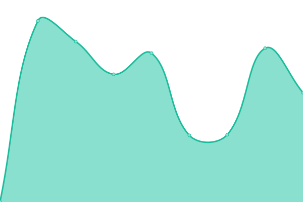
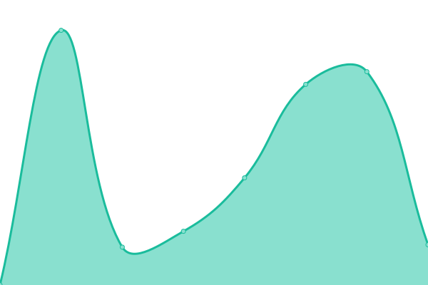
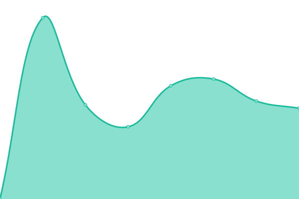

# [📈 Live Status](https://uptime.pearanalytics.com): <!--live status--> **🟧 Partial outage**

This repository contains the open-source uptime monitor and status page for [pearanalytics](https://uptime.pearanalytics.com), powered by [Upptime](https://github.com/upptime/upptime).

With [Upptime](https://upptime.js.org), you can get your own unlimited and free uptime monitor and status page, powered entirely by a GitHub repository. We use [Issues](https://github.com/pearanalytics/uptime/issues) as incident reports, [Actions](https://github.com/pearanalytics/uptime/actions) as uptime monitors, and [Pages](https://uptime.pearanalytics.com) for the status page.

<!--start: status pages-->
<!-- This summary is generated by Upptime (https://github.com/upptime/upptime) -->
<!-- Do not edit this manually, your changes will be overwritten -->
<!-- prettier-ignore -->
| URL | Status | History | Response Time | Uptime |
| --- | ------ | ------- | ------------- | ------ |
|  [Pear Dev Site](https://peardev.wpengine.com) | 🟩 Up | [pear-dev-site.yml](https://github.com/pearanalytics/uptime/commits/HEAD/history/pear-dev-site.yml) | 

 333ms
     
 | 

<a href="https://uptime.pearanalytics.com/history/pear-dev-site">100.00%</a>
    

|  [wellnesstech](https://wellnesstech.wpengine.com) | 🟥 Down | [wellnesstech.yml](https://github.com/pearanalytics/uptime/commits/HEAD/history/wellnesstech.yml) | 

 419ms
     
 | 

<a href="https://uptime.pearanalytics.com/history/wellnesstech">0.00%</a>
    

|  [pearanalytics](https://pearanalytics.com) | 🟩 Up | [pearanalytics.yml](https://github.com/pearanalytics/uptime/commits/HEAD/history/pearanalytics.yml) | 

 394ms
     
 | 

<a href="https://uptime.pearanalytics.com/history/pearanalytics">100.00%</a>
    

|  [fladvisors](https://fladvisors.com) | 🟩 Up | [fladvisors.yml](https://github.com/pearanalytics/uptime/commits/HEAD/history/fladvisors.yml) | 

 464ms
     
 | 

<a href="https://uptime.pearanalytics.com/history/fladvisors">100.00%</a>
    

|  [copc](https://copc.wpengine.com) | 🟩 Up | [copc.yml](https://github.com/pearanalytics/uptime/commits/HEAD/history/copc.yml) | 

 901ms
     
 | 

<a href="https://uptime.pearanalytics.com/history/copc">100.00%</a>
    

|  [universalbb](https://universalbookbindery.com) | 🟩 Up | [universalbb.yml](https://github.com/pearanalytics/uptime/commits/HEAD/history/universalbb.yml) | 

 313ms
     
 | 

<a href="https://uptime.pearanalytics.com/history/universalbb">100.00%</a>
    

|  [concussionguy](https://concussionguy.com) | 🟩 Up | [concussionguy.yml](https://github.com/pearanalytics/uptime/commits/HEAD/history/concussionguy.yml) | 

 279ms
     
 | 

<a href="https://uptime.pearanalytics.com/history/concussionguy">100.00%</a>
    

|  [copccopy](https://copccopy.wpengine.com) | 🟩 Up | [copccopy.yml](https://github.com/pearanalytics/uptime/commits/HEAD/history/copccopy.yml) | 

 1236ms
     
 | 

<a href="https://uptime.pearanalytics.com/history/copccopy">100.00%</a>
    

|  [alamonote](https://alamonote.wpengine.com) | 🟩 Up | [alamonote.yml](https://github.com/pearanalytics/uptime/commits/HEAD/history/alamonote.yml) | 

 495ms
     
 | 

<a href="https://uptime.pearanalytics.com/history/alamonote">100.00%</a>
    

|  [shirane](https://shiranefoundation.org) | 🟩 Up | [shirane.yml](https://github.com/pearanalytics/uptime/commits/HEAD/history/shirane.yml) | 

 405ms
     
 | 

<a href="https://uptime.pearanalytics.com/history/shirane">100.00%</a>
    

|  [intranetpear](https://intranetpear.wpengine.com) | 🟥 Down | [intranetpear.yml](https://github.com/pearanalytics/uptime/commits/HEAD/history/intranetpear.yml) | 

 351ms
     
 | 

<a href="https://uptime.pearanalytics.com/history/intranetpear">0.00%</a>
    

|  [aceschoolorg](https://aceschoolorg.wpengine.com) | 🟥 Down | [aceschoolorg.yml](https://github.com/pearanalytics/uptime/commits/HEAD/history/aceschoolorg.yml) | 

 0ms
     
 | 

<a href="https://uptime.pearanalytics.com/history/aceschoolorg">0.00%</a>
    

|  [eharris](https://eharris.wpengine.com) | 🟩 Up | [eharris.yml](https://github.com/pearanalytics/uptime/commits/HEAD/history/eharris.yml) | 

 1254ms
     
 | 

<a href="https://uptime.pearanalytics.com/history/eharris">100.00%</a>
    

|  [bhrnew](https://berkshirehairremoval.com) | 🟩 Up | [bhrnew.yml](https://github.com/pearanalytics/uptime/commits/HEAD/history/bhrnew.yml) | 

 374ms
     
 | 

<a href="https://uptime.pearanalytics.com/history/bhrnew">100.00%</a>
    

|  [findingstax](https://findingstax.wpengine.com) | 🟩 Up | [findingstax.yml](https://github.com/pearanalytics/uptime/commits/HEAD/history/findingstax.yml) | 

 317ms
     
 | 

<a href="https://uptime.pearanalytics.com/history/findingstax">100.00%</a>
    

|  [acadian](https://acadianlogistics.com) | 🟩 Up | [acadian.yml](https://github.com/pearanalytics/uptime/commits/HEAD/history/acadian.yml) | 

 761ms
     
 | 

<a href="https://uptime.pearanalytics.com/history/acadian">100.00%</a>
    

|  [beaconunited2](https://beacon-united.com) | 🟥 Down | [beaconunited2.yml](https://github.com/pearanalytics/uptime/commits/HEAD/history/beaconunited2.yml) | 

 0ms
     
 | 

<a href="https://uptime.pearanalytics.com/history/beaconunited2">0.00%</a>
    

|  [apgroup](https://apgroup.wpengine.com) | 🟥 Down | [apgroup.yml](https://github.com/pearanalytics/uptime/commits/HEAD/history/apgroup.yml) | 

 0ms
     
 | 

<a href="https://uptime.pearanalytics.com/history/apgroup">0.00%</a>
    

|  [xmasshowcase](https://christmasshowcase.com) | 🟥 Down | [xmasshowcase.yml](https://github.com/pearanalytics/uptime/commits/HEAD/history/xmasshowcase.yml) | 

 0ms
     
 | 

<a href="https://uptime.pearanalytics.com/history/xmasshowcase">0.00%</a>
    

|  [strauch](https://www.strauchlaw.com) | 🟩 Up | [strauch.yml](https://github.com/pearanalytics/uptime/commits/HEAD/history/strauch.yml) | 

 504ms
     
 | 

<a href="https://uptime.pearanalytics.com/history/strauch">100.00%</a>
    

|  [copcnew](https://www.copc.com) | 🟩 Up | [copcnew.yml](https://github.com/pearanalytics/uptime/commits/HEAD/history/copcnew.yml) | 

 570ms
     
 | 

<a href="https://uptime.pearanalytics.com/history/copcnew">100.00%</a>
    

|  [depexp](https://dependableexpress.com) | 🟥 Down | [depexp.yml](https://github.com/pearanalytics/uptime/commits/HEAD/history/depexp.yml) | 

 0ms
     
 | 

<a href="https://uptime.pearanalytics.com/history/depexp">0.00%</a>
    

|  [amazingair](https://amazingairsolutions.co) | 🟩 Up | [amazingair.yml](https://github.com/pearanalytics/uptime/commits/HEAD/history/amazingair.yml) | 

 704ms
     
 | 

<a href="https://uptime.pearanalytics.com/history/amazingair">100.00%</a>
    

|  [firsttexan](https://firsttexanrealty.com) | 🟩 Up | [firsttexan.yml](https://github.com/pearanalytics/uptime/commits/HEAD/history/firsttexan.yml) | 

 277ms
     
 | 

<a href="https://uptime.pearanalytics.com/history/firsttexan">100.00%</a>
    

|  [najim](https://najimfoundation.org) | 🟩 Up | [najim.yml](https://github.com/pearanalytics/uptime/commits/HEAD/history/najim.yml) | 

 4508ms
     
 | 

<a href="https://uptime.pearanalytics.com/history/najim">100.00%</a>
    

|  [contegoim](https://contegoim.com) | 🟩 Up | [contegoim.yml](https://github.com/pearanalytics/uptime/commits/HEAD/history/contegoim.yml) | 

 322ms
     
 | 

<a href="https://uptime.pearanalytics.com/history/contegoim">100.00%</a>
    

|  [alamomineral](https://alamomineralbuyers.com) | 🟩 Up | [alamomineral.yml](https://github.com/pearanalytics/uptime/commits/HEAD/history/alamomineral.yml) | 

 186ms
     
 | 

<a href="https://uptime.pearanalytics.com/history/alamomineral">100.00%</a>
    

|  [alamohomebuyer](https://alamohomebuyers.com) | 🟩 Up | [alamohomebuyer.yml](https://github.com/pearanalytics/uptime/commits/HEAD/history/alamohomebuyer.yml) | 

 215ms
     
 | 

<a href="https://uptime.pearanalytics.com/history/alamohomebuyer">100.00%</a>
    

|  [sanotebuyer](https://sanotebuyer.wpengine.com) | 🟩 Up | [sanotebuyer.yml](https://github.com/pearanalytics/uptime/commits/HEAD/history/sanotebuyer.yml) | 

 644ms
     
 | 

<a href="https://uptime.pearanalytics.com/history/sanotebuyer">100.00%</a>
    

|  [sahomebuyer](https://sahomebuyer.wpengine.com) | 🟩 Up | [sahomebuyer.yml](https://github.com/pearanalytics/uptime/commits/HEAD/history/sahomebuyer.yml) | 

 627ms
     
 | 

<a href="https://uptime.pearanalytics.com/history/sahomebuyer">100.00%</a>
    

|  [fascinationsp](https://fascinationstreetpod.com) | 🟩 Up | [fascinationsp.yml](https://github.com/pearanalytics/uptime/commits/HEAD/history/fascinationsp.yml) | 

 349ms
     
 | 

<a href="https://uptime.pearanalytics.com/history/fascinationsp">100.00%</a>
    

|  [alamobuyers](https://alamobuyers.com) | 🟩 Up | [alamobuyers.yml](https://github.com/pearanalytics/uptime/commits/HEAD/history/alamobuyers.yml) | 

 405ms
     
 | 

<a href="https://uptime.pearanalytics.com/history/alamobuyers">100.00%</a>
    

|  [tluadm](https://tluadm.wpengine.com) | 🟩 Up | [tluadm.yml](https://github.com/pearanalytics/uptime/commits/HEAD/history/tluadm.yml) | 

 1074ms
     
 | 

<a href="https://uptime.pearanalytics.com/history/tluadm">100.00%</a>
    

|  [homworks](https://homworks.wpengine.com) | 🟥 Down | [homworks.yml](https://github.com/pearanalytics/uptime/commits/HEAD/history/homworks.yml) | 

 263ms
     
 | 

<a href="https://uptime.pearanalytics.com/history/homworks">0.00%</a>
    

|  [stssh](https://saroboticsurgery.com) | 🟥 Down | [stssh.yml](https://github.com/pearanalytics/uptime/commits/HEAD/history/stssh.yml) | 

 0ms
     
 | 

<a href="https://uptime.pearanalytics.com/history/stssh">0.00%</a>
    

|  [saparksfound](https://saparksfoundation.org) | 🟩 Up | [saparksfound.yml](https://github.com/pearanalytics/uptime/commits/HEAD/history/saparksfound.yml) | 

 481ms
     
 | 

<a href="https://uptime.pearanalytics.com/history/saparksfound">100.00%</a>
    

|  [sabuyers](https://sabuyers.wpengine.com) | 🟩 Up | [sabuyers.yml](https://github.com/pearanalytics/uptime/commits/HEAD/history/sabuyers.yml) | 

 613ms
     
 | 

<a href="https://uptime.pearanalytics.com/history/sabuyers">100.00%</a>
    

|  [sabuyer](https://sabuyer.wpengine.com) | 🟩 Up | [sabuyer.yml](https://github.com/pearanalytics/uptime/commits/HEAD/history/sabuyer.yml) | 

 631ms
     
 | 

<a href="https://uptime.pearanalytics.com/history/sabuyer">100.00%</a>
    

|  [sellmyplace](https://sellmyplace.wpengine.com) | 🟩 Up | [sellmyplace.yml](https://github.com/pearanalytics/uptime/commits/HEAD/history/sellmyplace.yml) | 

 627ms
     
 | 

<a href="https://uptime.pearanalytics.com/history/sellmyplace">100.00%</a>
    

|  [sellmynote](https://sellmynote.com) | 🟩 Up | [sellmynote.yml](https://github.com/pearanalytics/uptime/commits/HEAD/history/sellmynote.yml) | 

 196ms
     
 | 

<a href="https://uptime.pearanalytics.com/history/sellmynote">100.00%</a>
    

|  [sandlersa](https://sandlersa.wpengine.com) | 🟩 Up | [sandlersa.yml](https://github.com/pearanalytics/uptime/commits/HEAD/history/sandlersa.yml) | 

 648ms
     
 | 

<a href="https://uptime.pearanalytics.com/history/sandlersa">100.00%</a>
    

|  [yokelfinancial](https://yokelfinancial.wpengine.com) | 🟩 Up | [yokelfinancial.yml](https://github.com/pearanalytics/uptime/commits/HEAD/history/yokelfinancial.yml) | 

 965ms
     
 | 

<a href="https://uptime.pearanalytics.com/history/yokelfinancial">100.00%</a>
    

|  [copcprocure](https://copcprocure.wpengine.com) | 🟩 Up | [copcprocure.yml](https://github.com/pearanalytics/uptime/commits/HEAD/history/copcprocure.yml) | 

 742ms
     
 | 

<a href="https://uptime.pearanalytics.com/history/copcprocure">100.00%</a>
    

|  [jsbhs](https://jsbhs.wpengine.com) | 🟩 Up | [jsbhs.yml](https://github.com/pearanalytics/uptime/commits/HEAD/history/jsbhs.yml) | 

 1307ms
     
 | 

<a href="https://uptime.pearanalytics.com/history/jsbhs">100.00%</a>
    

|  [felixgonzalez2](https://www.felixgonzalezlaw.com) | 🟩 Up | [felixgonzalez2.yml](https://github.com/pearanalytics/uptime/commits/HEAD/history/felixgonzalez2.yml) | 

 1234ms
     
 | 

<a href="https://uptime.pearanalytics.com/history/felixgonzalez2">100.00%</a>
    

|  [ehrenberg](https://ehrenberg.wpengine.com) | 🟩 Up | [ehrenberg.yml](https://github.com/pearanalytics/uptime/commits/HEAD/history/ehrenberg.yml) | 

 622ms
     
 | 

<a href="https://uptime.pearanalytics.com/history/ehrenberg">100.00%</a>
    

|  [eharrisv2](https://www.eharrismd.com) | 🟩 Up | [eharrisv2.yml](https://github.com/pearanalytics/uptime/commits/HEAD/history/eharrisv2.yml) | 

 373ms
     
 | 

<a href="https://uptime.pearanalytics.com/history/eharrisv2">100.00%</a>
    

|  [riachueloranch](https://riachueloranch.com) | 🟩 Up | [riachueloranch.yml](https://github.com/pearanalytics/uptime/commits/HEAD/history/riachueloranch.yml) | 

 387ms
     
 | 

<a href="https://uptime.pearanalytics.com/history/riachueloranch">100.00%</a>
    

|  [ignitecc](https://ignitecommunity.church) | 🟩 Up | [ignitecc.yml](https://github.com/pearanalytics/uptime/commits/HEAD/history/ignitecc.yml) | 

 402ms
     
 | 

<a href="https://uptime.pearanalytics.com/history/ignitecc">100.00%</a>
    

|  [altitudesa](https://www.altitudesa.com) | 🟩 Up | [altitudesa.yml](https://github.com/pearanalytics/uptime/commits/HEAD/history/altitudesa.yml) | 

 556ms
     
 | 

<a href="https://uptime.pearanalytics.com/history/altitudesa">100.00%</a>
    

|  [idpsalientup](https://indirectpro.com) | 🟩 Up | [idpsalientup.yml](https://github.com/pearanalytics/uptime/commits/HEAD/history/idpsalientup.yml) | 

 550ms
     
 | 

<a href="https://uptime.pearanalytics.com/history/idpsalientup">100.00%</a>
    

|  [copcsalientup](https://copcsalientup.wpengine.com) | 🟩 Up | [copcsalientup.yml](https://github.com/pearanalytics/uptime/commits/HEAD/history/copcsalientup.yml) | 

 2151ms
     
 | 

<a href="https://uptime.pearanalytics.com/history/copcsalientup">100.00%</a>
    

|  [hartmanfound](https://gordonhartman.com) | 🟩 Up | [hartmanfound.yml](https://github.com/pearanalytics/uptime/commits/HEAD/history/hartmanfound.yml) | 

 1321ms
     
 | 

<a href="https://uptime.pearanalytics.com/history/hartmanfound">100.00%</a>
    

|  [hotshotfinal](https://hotshotfinalmile.com) | 🟩 Up | [hotshotfinal.yml](https://github.com/pearanalytics/uptime/commits/HEAD/history/hotshotfinal.yml) | 

 411ms
     
 | 

<a href="https://uptime.pearanalytics.com/history/hotshotfinal">100.00%</a>
    

|  [workatmercho](https://workatmerchco.com) | 🟩 Up | [workatmercho.yml](https://github.com/pearanalytics/uptime/commits/HEAD/history/workatmercho.yml) | 

 425ms
     
 | 

<a href="https://uptime.pearanalytics.com/history/workatmercho">100.00%</a>
    

|  [merchcomain](https://merchcoservices.com) | 🟩 Up | [merchcomain.yml](https://github.com/pearanalytics/uptime/commits/HEAD/history/merchcomain.yml) | 

 478ms
     
 | 

<a href="https://uptime.pearanalytics.com/history/merchcomain">100.00%</a>
    

|  [ibuysa](https://ibuysa.wpengine.com) | 🟩 Up | [ibuysa.yml](https://github.com/pearanalytics/uptime/commits/HEAD/history/ibuysa.yml) | 

 948ms
     
 | 

<a href="https://uptime.pearanalytics.com/history/ibuysa">100.00%</a>
    

|  [hdnew](https://www.thetriallawyers.com) | 🟩 Up | [hdnew.yml](https://github.com/pearanalytics/uptime/commits/HEAD/history/hdnew.yml) | 

 497ms
     
 | 

<a href="https://uptime.pearanalytics.com/history/hdnew">100.00%</a>
    

|  [tuyatech](https://tuyatech.com) | 🟩 Up | [tuyatech.yml](https://github.com/pearanalytics/uptime/commits/HEAD/history/tuyatech.yml) | 

 367ms
     
 | 

<a href="https://uptime.pearanalytics.com/history/tuyatech">100.00%</a>
    

|  [alamofireworks](https://www.alamofireworks.com) | 🟩 Up | [alamofireworks.yml](https://github.com/pearanalytics/uptime/commits/HEAD/history/alamofireworks.yml) | 

 564ms
     
 | 

<a href="https://uptime.pearanalytics.com/history/alamofireworks">100.00%</a>
    

|  [beeclean](https://beeclean.wpengine.com) | 🟩 Up | [beeclean.yml](https://github.com/pearanalytics/uptime/commits/HEAD/history/beeclean.yml) | 

 2581ms
     
 | 

<a href="https://uptime.pearanalytics.com/history/beeclean">2.15%</a>
    

|  [siteowl](https://siteowl.wpengine.com) | 🟩 Up | [siteowl.yml](https://github.com/pearanalytics/uptime/commits/HEAD/history/siteowl.yml) | 

 1199ms
     
 | 

<a href="https://uptime.pearanalytics.com/history/siteowl">14.99%</a>
    

|  [emmajanev1](https://emmajanev1.wpengine.com) | 🟩 Up | [emmajanev1.yml](https://github.com/pearanalytics/uptime/commits/HEAD/history/emmajanev1.yml) | 

 629ms
     
 | 

<a href="https://uptime.pearanalytics.com/history/emmajanev1">100.00%</a>
    

|  [robinsonvm](https://www.robinsonvalue.com) | 🟩 Up | [robinsonvm.yml](https://github.com/pearanalytics/uptime/commits/HEAD/history/robinsonvm.yml) | 

 446ms
     
 | 

<a href="https://uptime.pearanalytics.com/history/robinsonvm">100.00%</a>
    

|  [edgecombe](https://edgecombe.com) | 🟩 Up | [edgecombe.yml](https://github.com/pearanalytics/uptime/commits/HEAD/history/edgecombe.yml) | 

 1904ms
     
 | 

<a href="https://uptime.pearanalytics.com/history/edgecombe">100.00%</a>
    

|  [lesauce](https://lesauce.wpengine.com) | 🟩 Up | [lesauce.yml](https://github.com/pearanalytics/uptime/commits/HEAD/history/lesauce.yml) | 

 772ms
     
 | 

<a href="https://uptime.pearanalytics.com/history/lesauce">100.00%</a>
    

|  [beecleanold](https://beecleanold.wpengine.com) | 🟩 Up | [beecleanold.yml](https://github.com/pearanalytics/uptime/commits/HEAD/history/beecleanold.yml) | 

 473ms
     
 | 

<a href="https://uptime.pearanalytics.com/history/beecleanold">100.00%</a>
    

|  [mdunnebrands](https://dunnebrands.com) | 🟩 Up | [mdunnebrands.yml](https://github.com/pearanalytics/uptime/commits/HEAD/history/mdunnebrands.yml) | 

 408ms
     
 | 

<a href="https://uptime.pearanalytics.com/history/mdunnebrands">100.00%</a>
    

|  [sacounselors](https://sacounselors.wpengine.com) | 🟩 Up | [sacounselors.yml](https://github.com/pearanalytics/uptime/commits/HEAD/history/sacounselors.yml) | 

 1468ms
     
 | 

<a href="https://uptime.pearanalytics.com/history/sacounselors">100.00%</a>
    

|  [riptidewash](https://riptideautowashes.com) | 🟩 Up | [riptidewash.yml](https://github.com/pearanalytics/uptime/commits/HEAD/history/riptidewash.yml) | 

 391ms
     
 | 

<a href="https://uptime.pearanalytics.com/history/riptidewash">100.00%</a>
    

|  [officefurnliq](https://www.officefurnituresa.com) | 🟩 Up | [officefurnliq.yml](https://github.com/pearanalytics/uptime/commits/HEAD/history/officefurnliq.yml) | 

 527ms
     
 | 

<a href="https://uptime.pearanalytics.com/history/officefurnliq">100.00%</a>
    

|  [espronceda](https://alamodivorcelawyer.com) | 🟩 Up | [espronceda.yml](https://github.com/pearanalytics/uptime/commits/HEAD/history/espronceda.yml) | 

 396ms
     
 | 

<a href="https://uptime.pearanalytics.com/history/espronceda">100.00%</a>
    

|  [unrealdigital](https://www.unrealdigitalgroup.com) | 🟩 Up | [unrealdigital.yml](https://github.com/pearanalytics/uptime/commits/HEAD/history/unrealdigital.yml) | 

 404ms
     
 | 

<a href="https://uptime.pearanalytics.com/history/unrealdigital">100.00%</a>
    

|  [npinaction](https://nonprofitsinaction.org) | 🟩 Up | [npinaction.yml](https://github.com/pearanalytics/uptime/commits/HEAD/history/npinaction.yml) | 

 331ms
     
 | 

<a href="https://uptime.pearanalytics.com/history/npinaction">100.00%</a>
    

|  [riptideuvalde](https://uvaldecarwash.com) | 🟩 Up | [riptideuvalde.yml](https://github.com/pearanalytics/uptime/commits/HEAD/history/riptideuvalde.yml) | 

 377ms
     
 | 

<a href="https://uptime.pearanalytics.com/history/riptideuvalde">100.00%</a>
    

|  [logopop](https://thelogopop.com) | 🟩 Up | [logopop.yml](https://github.com/pearanalytics/uptime/commits/HEAD/history/logopop.yml) | 

 298ms
     
 | 

<a href="https://uptime.pearanalytics.com/history/logopop">100.00%</a>
    

|  [xenexlive](https://xenex.com) | 🟩 Up | [xenexlive.yml](https://github.com/pearanalytics/uptime/commits/HEAD/history/xenexlive.yml) | 

 411ms
     
 | 

<a href="https://uptime.pearanalytics.com/history/xenexlive">100.00%</a>
    

|  [allenlive](https://lumberhardware.com) | 🟩 Up | [allenlive.yml](https://github.com/pearanalytics/uptime/commits/HEAD/history/allenlive.yml) | 

 471ms
     
 | 

<a href="https://uptime.pearanalytics.com/history/allenlive">100.00%</a>
    

|  [nomaskspatriot](https://nomaskspatriot.wpengine.com) | 🟩 Up | [nomaskspatriot.yml](https://github.com/pearanalytics/uptime/commits/HEAD/history/nomaskspatriot.yml) | 

 578ms
     
 | 

<a href="https://uptime.pearanalytics.com/history/nomaskspatriot">100.00%</a>
    

<!--end: status pages-->

[**Visit our status website →**](https://uptime.pearanalytics.com)

## 📄 License

- Powered by: [Upptime](https://github.com/upptime/upptime)
- Code: [MIT](./LICENSE) © [pearanalytics](https://uptime.pearanalytics.com)
- Data in the `./history` directory: [Open Database License](https://opendatacommons.org/licenses/odbl/1-0/)
